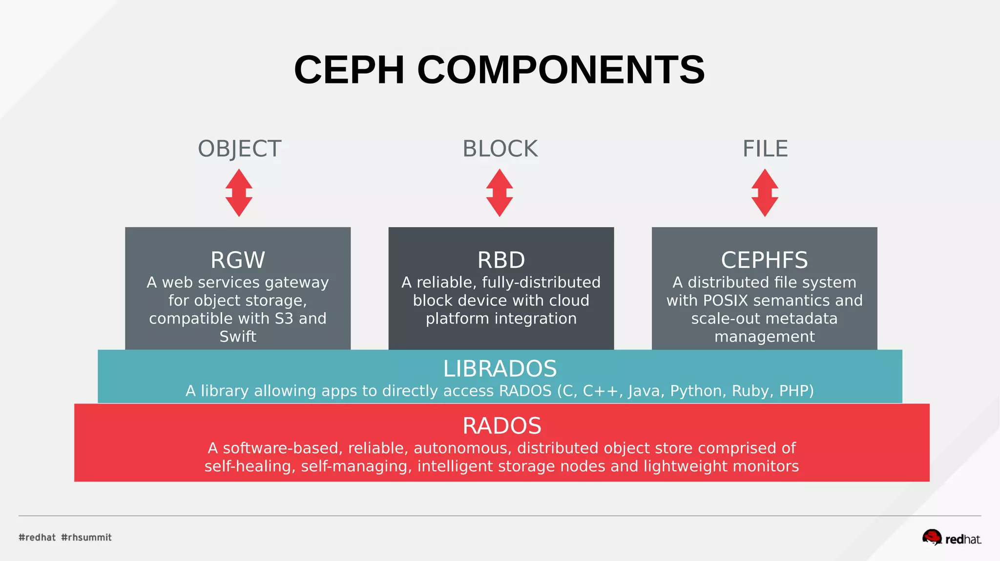
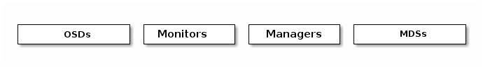
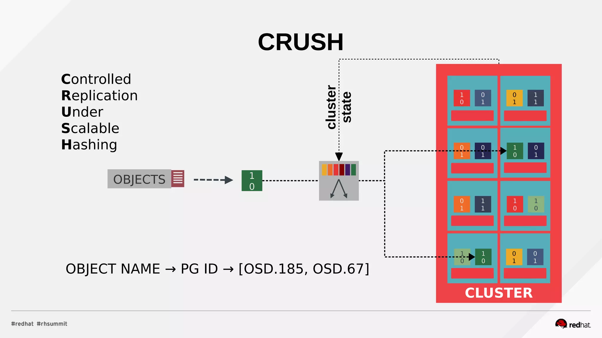

# Introduction to Ceph

Before to start I would like to show promotional of ceph which resumes pretty good what we are going to talk about

<iframe width="650" height="415" src="https://www.youtube.com/embed/QBkH1g4DuKE" title="YouTube video player" frameborder="0" allow="accelerometer; autoplay; clipboard-write; encrypted-media; gyroscope; picture-in-picture; web-share" allowfullscreen></iframe>

#### Overview of Ceph and its features

[Ceph](https://ceph.io/en/) is an open-source storage platform that provides scalable and reliable storage for different types of data. It can store unstructured data as objects and also supports block storage and a shared file system.

Rook uses Ceph as storage solution and therefore Koor uses Ceph as well, some the key features that Ceph has are:

- **Distributed Architecture**: Ceph can scale horizontally by adding more storage nodes, making it fault-tolerant.
- **Object Storage**: It stores large amounts of unstructured data efficiently, with compatibility for existing applications.
- **Block Storage**: Ceph creates virtual block devices for applications and operating systems, offering features like cloning and snapshots.
- **POSIX File System**: It provides a shared file system experience for multiple clients to access simultaneously.
- **Data Protection**: Ceph offers data replication and erasure coding for fault tolerance and storage efficiency.
- **Auto-tiering**: Data is automatically moved between different storage tiers based on usage patterns.
- **Scalability and Performance**: Ceph scales from a few nodes to thousands, providing high throughput and low-latency access.
- **Community and Ecosystem**: Ceph has a strong open-source community and wide adoption, leading to continuous improvement.

#### Understanding Ceph's architecture

Ceph stands out by providing a unified system that combines object, block, and file storage.
Ceph exhibits remarkable scalability, enabling thousands of clients to access and manage petabytes to exabytes of data.
It achieves this by utilizing cost-effective hardware and intelligent daemons within Ceph Nodes.
A Ceph Storage Cluster effectively handles a large number of nodes that communicate, dynamically replicating and redistributing data.

{ align=center }

#### Ceph components

Ceph provides an infinitely scalable Ceph Storage Cluster based upon [RADOS](https://ceph.io/assets/pdfs/weil-rados-pdsw07.pdf)

A Ceph Storage Cluster consists of multiple types of daemons:

- **Ceph Monitor**: maintains a master copy of the cluster map. A cluster of Ceph monitors ensures high availability should a monitor daemon fail. Storage cluster clients retrieve a copy of the cluster map from the Ceph Monitor.
- **Ceph OSD Daemon**: checks its own state and the state of other OSDs and reports back to monitors
- **Ceph Manager**: acts as an endpoint for monitoring, orchestration, and plug-in modules.
- **Ceph Metadata Server (MDS)**: manages file metadata when CephFS is used to provide file services.
- **Ceph Metadata Server (MDS)**: manages file metadata when CephFS is used to provide file services.

{ align=center }

#### CRUSH Algorithm

Storage cluster clients and each Ceph OSD Daemon use the CRUSH (Controlled Replication Under Scalable Hashing) algorithm to efficiently compute information about data location, instead of having to depend on a central lookup table.

CRUSH distributes data evenly across available object storage devices in what is often described as a pseudo-random manner.
Distribution is controlled by a hierarchical cluster map called a [CRUSH map](https://docs.ceph.com/en/latest/rados/operations/crush-map/). The map, which can be customized by the storage administrator, informs the cluster about the layout and capacity of nodes in the storage network and
specifies how redundancy should be managed.

By allowing cluster nodes to calculate where a data item has been stored,
CRUSH avoids the need to look up data locations in a central directory. CRUSH also allows for nodes to be added or removed,
moving as few objects as possible while still maintaining balance across the new cluster configuration.

{ align=center }

Ceph is an awesome storage solution designed to address the block, file and object storage needs,
of course to use it in Kubernetes could be a challenging Rook is designed to simplify this process, in the next chapter
[Installing and Using Rook](introduction-to-rook.md) we are going to learn more about this solution.
