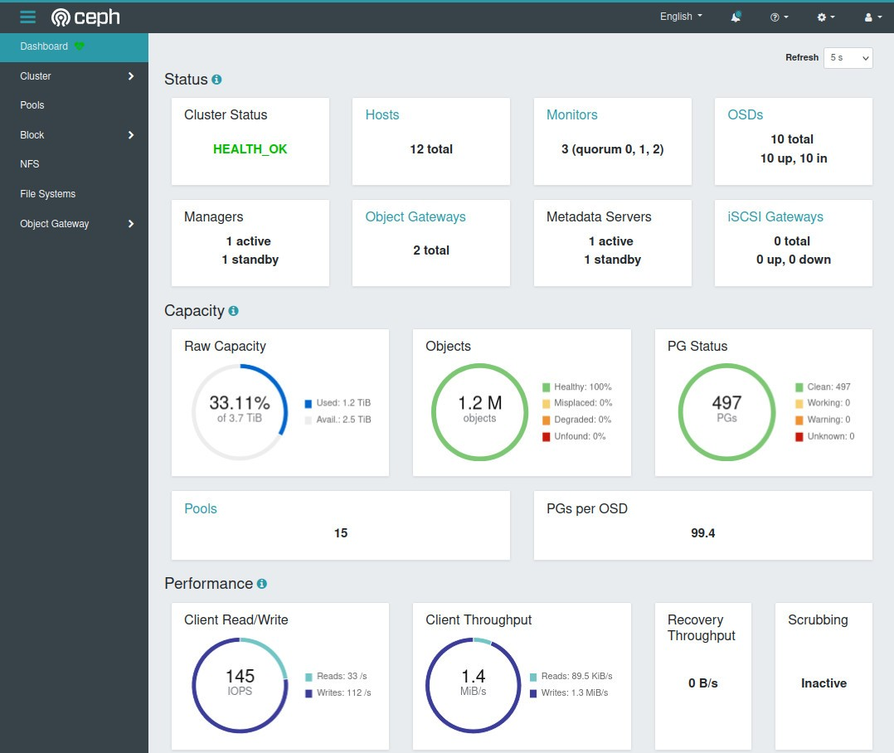
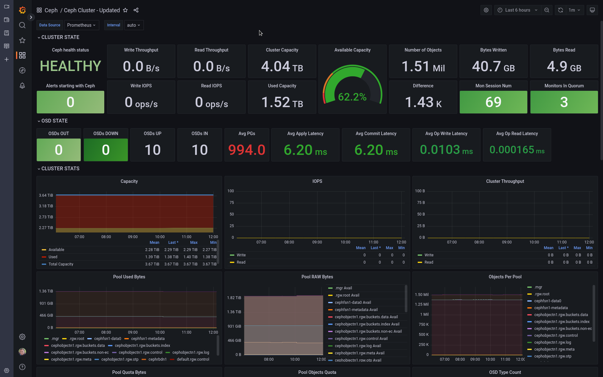

## Automated Configuration of Dashboard SSO

Koor adds automatic configuration of the Ceph dashboard's SSO (Single Sign On) to make it quick and easy to access the Ceph dashboard safely.

You just need to add some lines of YAML to your existing `CephCluster`/`KoorStorageCluster` object:

```yaml
apiVersion: ceph.rook.io/v1
kind: CephCluster
metadata:
  name: rook-ceph
  namespace: rook-ceph # namespace:cluster
spec:
# [...]
  dashboard:
    enabled: true
    ssl: true
    sso:
      enabled: true
      # Your Identity provider of choice (e.g., Keycloak)
      baseUrl: "https://ceph-dash.example.com"
      #entityID: "<idp_entity_id>"
      idpMetadataUrl: "https://keycloak.example.com/auth/realms/myrealm/protocol/saml/descriptor"
      idpAttributes:
        username: "username"
      users:
        - username: USERNAME
          roles:
            - administrator
        # [...]
```

The operator takes care of configuring the Ceph dashboard and you should be redirected to your SSO provider for login.



## General Updates and Features for Community

### Updated Grafana Dashboards for better Visualizing Cluster Metrics

We have worked together with the community to update the Ceph dashboards to make it easier for everyone to keep an eye on their Ceph clusters.


