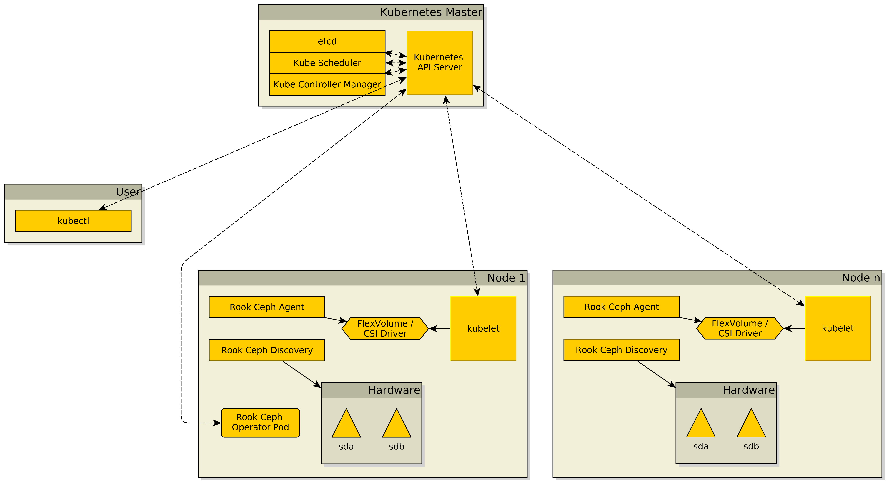

_The source for the diagrams, can be found as `.graphml` at the same path as the images._

## Rook Ceph Components

Where the "basic" components are the rook-ceph-agent and `rook-discover` DaemonSet.

!!! note
    * Rook Ceph Discovery DaemonSet is **only started after at least one CephCluster has been created!**
    * Rook Ceph Agent ("Flex driver") was used in earlier Rook Ceph versions for mounting storage, before it a switch to use Ceph CSI driver was made.
